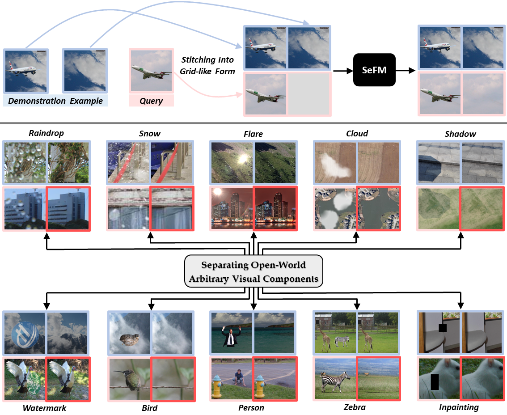
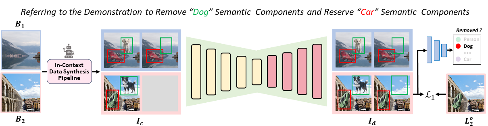

# Separating Anything from Image in Context (in submission)

## :bulb: Highlight
 - :heart_eyes: :heart_eyes: SeFM is a novel generalist foundation model for separating anything from images.
 - :heart_eyes: :heart_eyes: Only a handy demonstration example is required.
 - :heart_eyes: :heart_eyes: Exhibiting groundbreaking generalization capability to open-world unseen visual components. 
<table>
  <tr>
    <td>  </td>
  </tr>
</table>

## :label: TODO 
- [ ] Release inference code and demo.
- [ ] Release checkpoints.
- [ ] Release training codes.

## :medal_military: Framework Architecture
<table>
  <tr>
    <td>  </td>
  </tr>
  <tr>
    <td><p align="center"><b>Overall Framework of SeFM</b></p></td>
  </tr>
</table>

      
## :hammer_and_wrench: Installation
`The model is built in PyTorch 1.8.0 and tested on Ubuntu 16.04 environment (Python3.7, CUDA9.0, cuDNN7.5).`

1. Clone the SeFM repository from GitHub:

```bash
git clone https://github.com/Jeasco/SeFM
cd SeFM
```

2. Install the required dependencies and SeFM:

```bash
pip3 install -r requirements.txt
python3 -m pip install -e .
```

### Training

```
bash sefm_training.sh
```


### Evaluation

1. Download the pre-trained model and place it in `./checkpoints/`

2. Place the test image in `./test/`

3. Run
```
python in_context_inference_demo.py
```
4. Visual results will be saved in results


